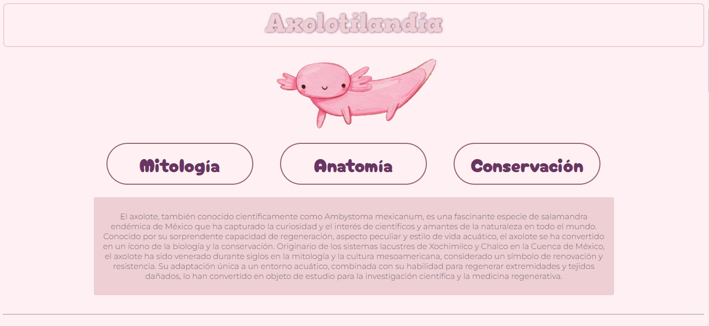
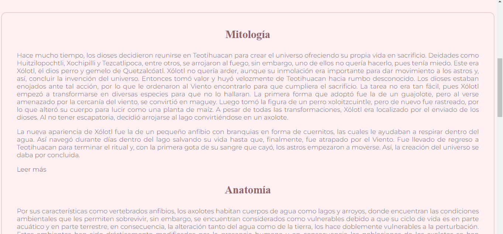
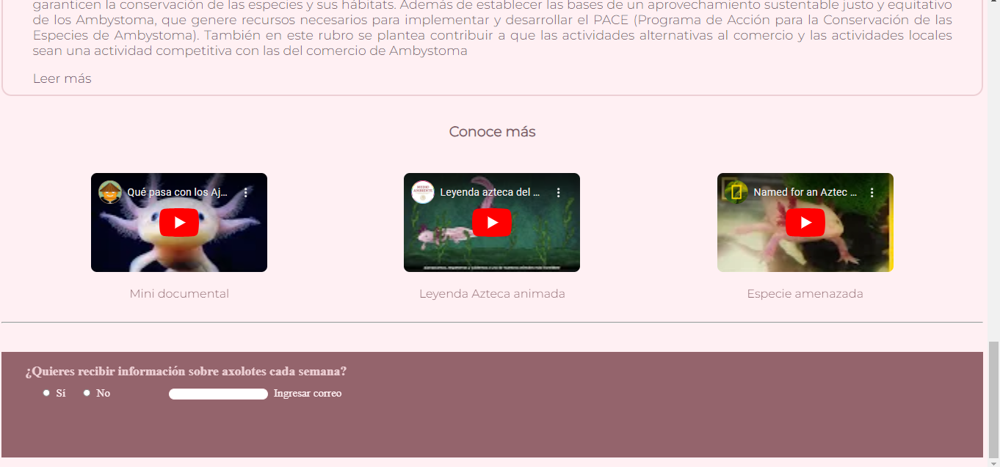

# Axolotl Informative Webpage

This repository contains an informative webpage about axolotes created as part of the TECNOLOCHICAS bootcamp project.

## Technologies Used

- HTML
- CSS

## Getting Started

To view the webpage, simply open the `index.html` file in your web browser.

## Features

- Informative content about axolotes and their habitat.
- Responsive design for different devices.
- Styled using CSS.

## View the webpage
You can view the live webpage by clicking [here](https://axolotilandiakawaii.netlify.app/).

## Screenshots

## Contribution

Contributions to the project are welcome! If you find any issues or have suggestions for improvement, feel free to open an issue or submit a pull request.

## Credits
- Special thanks to TECNOLOCHICAS for the bootcamp opportunity.
